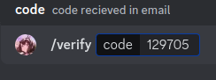

# ibi-bot

## Technologies
- uses discord.js 14.4 js
- Heroku Cloud
## Features
- Discord Verification
### Screenshots:

## install
1. get config.json and make sure values are correct
- verifyRole is VERIFY GENERAL
- rest are pretty self explanatory
1. run `node deploy-commands.js` 
2. run `node .` 

## To-do: 
- clear comments that are everywhere
- convert to TS if have time
